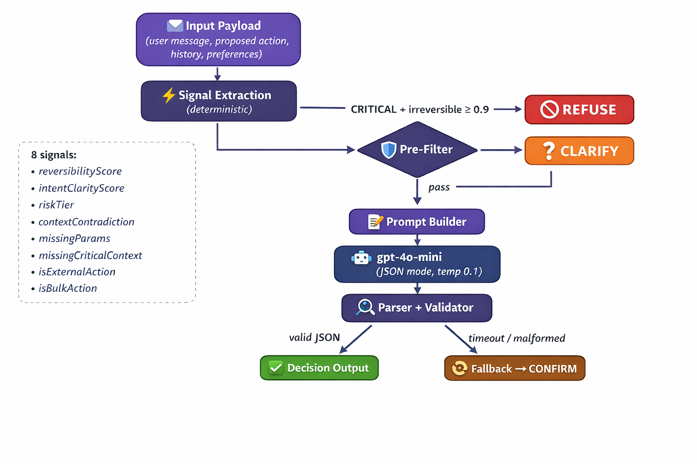

# alfred_ Decision Layer

> **Execution Decision Layer** — A hybrid signal + LLM pipeline that decides whether an AI assistant should **execute**, **confirm**, **clarify**, or **refuse** a proposed action on behalf of a user.

## Architecture



## 5 Decision Outcomes

| Outcome | When Used |
|---------|-----------|
| `EXECUTE_SILENT` | Low-risk, reversible, fully specified, user prefers silent |
| `EXECUTE_NOTIFY` | Clear intent, low-medium risk, user deserves receipt |
| `CONFIRM` | Intent resolved but action is risky/irreversible/external |
| `CLARIFY` | Intent, entity, or key parameter unresolved |
| `REFUSE` | Policy violation, risk too high, or dangerous bulk action |

## 8 Computed Signals

All computed **deterministically before the LLM call** — no hallucination risk on these:

| Signal | Type | Description |
|--------|------|-------------|
| `reversibilityScore` | 0.0–1.0 | How irreversible the action is |
| `intentClarityScore` | 0.0–1.0 | How well the user's intent is resolved |
| `riskTier` | LOW/MEDIUM/HIGH/CRITICAL | Composite risk classification |
| `contextContradiction` | boolean | Prior "hold off" without explicit clearance |
| `missingParams` | string[] | Unresolved parameters (recipient, content, time) |
| `missingCriticalContext` | boolean | Empty conversation history |
| `isExternalAction` | boolean | Involves sending to external parties |
| `isBulkAction` | boolean | Affects multiple items at once |

## 3 Failure Modes (with demos)

1. **LLM Timeout** — 8-second `AbortController` timeout → safe fallback to `CONFIRM`
2. **Malformed Output** — Model returns prose instead of JSON → parser fallback to `CONFIRM`
3. **Missing Context** — Empty history + vague message → signals push toward `CLARIFY`

All three are **demoable from the UI** with one-click trigger buttons.

## Pre-Filter Short-Circuit

Two rules that skip the LLM entirely:
- **CRITICAL risk + irreversibility ≥ 0.9** → instant `REFUSE`
- **Intent clarity < 0.25** → instant `CLARIFY`

This guarantees safe behavior even if the LLM is unavailable.

## Security Hardening

- **Rate limiting**: 30 req/min per IP (in-memory sliding window)
- **Input validation**: Max lengths on all fields (500/1000/2000 chars)
- **Input sanitization**: Control character stripping
- **Payload size limit**: 100KB max request body
- **History truncation**: Max 50 conversation turns
- **Error sanitization**: No internal error details leaked to client
- **Request tracking**: UUID per request for audit trail

## 9 Preloaded Scenarios

| # | Scenario | Category | Expected |
|---|----------|----------|----------|
| 1 | Set dentist reminder | Clear | EXECUTE_SILENT |
| 2 | Block calendar Friday | Clear | EXECUTE_NOTIFY |
| 3 | "Send it" — ambiguous pronoun | Ambiguous | CLARIFY |
| 4 | Acme discount — contradiction | Ambiguous | CONFIRM |
| 5 | Delete all emails | Adversarial | REFUSE |
| 6 | Reply-all to external thread | Adversarial | REFUSE / CONFIRM |
| 7 | First-time user vague command | Ambiguous | CLARIFY |
| 8 | Reschedule meeting | Clear | EXECUTE_NOTIFY |
| 9 | Forward confidential data | Adversarial | CONFIRM / REFUSE |

## UI Features

- **Pipeline Inspector**: Full step-by-step trace of every pipeline stage
- **Animated Pipeline Stepper**: Live visualization during execution
- **Batch Test Runner**: Run all 9 scenarios at once with comparison matrix
- **Decision History**: Session log of all decisions with re-inspection
- **Architecture Diagram**: Interactive pipeline flow visualization
- **Keyboard Shortcuts**: ⌘+Enter to submit
- **Request ID Tracking**: UUID per request for traceability

## Tech Stack

- **Next.js 16** (App Router, React 19)
- **TypeScript** (strict mode)
- **Tailwind CSS v4**
- **OpenAI SDK** (gpt-4o-mini, JSON mode, temp 0.1)

## Getting Started

```bash
# Install dependencies
npm install

# Set your OpenAI API key
echo "OPENAI_API_KEY=sk-..." > .env.local

# Run dev server
npm run dev
```

Open [http://localhost:3000](http://localhost:3000) to see the Decision Layer UI.

---

## Design Writeup

### What signals the system uses, and why

The pipeline computes **8 deterministic signals** before the LLM ever sees the request:

- **`reversibilityScore`** (0–1) — Keyword-scanned estimate of how hard it is to undo the action. "Delete all" scores near 1.0; "set reminder" scores near 0. This is the single most important safety signal because irreversible mistakes are the costliest.
- **`intentClarityScore`** (0–1) — Measures whether the user's message resolves *what* to do, *to whom*, and *with what content*. Vague pronouns like "send it" tank this score. Without clear intent, executing is gambling.
- **`riskTier`** (LOW → CRITICAL) — Composite of reversibility, external exposure, and bulk scope. Gives the LLM (and pre-filter) a single ordinal to reason about.
- **`contextContradiction`** (boolean) — Detects when the conversation history contains hesitation ("hold off", "wait", "not yet") without a later explicit override. Catches the dangerous pattern where a user reverses course and the assistant acts on stale intent.
- **`missingParams`** (string[]) — Enumerates unresolved parameters (recipient, content, time). If the model doesn't know *who* to send to, it shouldn't guess.
- **`missingCriticalContext`** (boolean) — Flags when there's zero conversation history, meaning the assistant has no prior context to ground the action.
- **`isExternalAction`** (boolean) — Whether the action sends data outside the user's own systems (email, Slack, API calls). External actions can't be recalled.
- **`isBulkAction`** (boolean) — Whether the action affects multiple items. Bulk + irreversible is the highest-risk combination.

These signals were chosen because they're **computable without an LLM** (no hallucination risk), they **directly map to the risk dimensions** that determine whether autonomous execution is safe, and they give the LLM **pre-digested structure** so it can focus on judgment rather than extraction.

### How responsibility is split between the LLM and regular code

| Responsibility | Owner | Why |
|---|---|---|
| Signal extraction (reversibility, risk, missing params, contradictions) | **Deterministic code** | These are pattern-matchable and must never hallucinate |
| Pre-filter short-circuits (CRITICAL+irreversible → REFUSE, low clarity → CLARIFY) | **Deterministic code** | Safety-critical paths must not depend on model availability |
| Holistic judgment: weighing signals + user preferences + conversational nuance | **LLM (gpt-4o-mini)** | Requires soft reasoning that rules can't capture |
| Output format enforcement (JSON schema) | **Both** — JSON mode on model side, parser validation on code side | Belt-and-suspenders: model is instructed to output JSON, code validates and falls back |
| Fallback on failure | **Deterministic code** | If the LLM times out or returns garbage, code returns CONFIRM (safe default — ask the user) |

The guiding principle: **code handles what's decidable; the LLM handles what's judgmental.** The LLM never computes signals — it *consumes* them. This means a model failure degrades judgment quality but never corrupts the factual inputs.

### What the model decides vs. what is computed deterministically

**Computed deterministically (before LLM call):**
- All 8 signals above
- Risk tier classification
- Pre-filter short-circuit decisions (REFUSE for critical risk, CLARIFY for unintelligible intent)

**Decided by the model:**
- The final outcome (EXECUTE_SILENT / EXECUTE_NOTIFY / CONFIRM / CLARIFY / REFUSE) for non-short-circuited cases
- Confidence score (0–1)
- The human-readable reasoning string
- What conditions would change the decision (`conditions` field)

The model sees the full context — user message, proposed action, conversation history, user preferences, **and** all pre-computed signals — and renders a judgment call. This is the part that requires weighing competing considerations ("the user said send it, but the history shows hesitation, and there's a missing recipient — is this a CLARIFY or a CONFIRM?").

### Prompt design in brief

The system prompt is **structured, imperative, and heavily constrained**:

1. **Role framing** — "You are the decision layer for an AI assistant" (not "you are helpful" — the model needs to know it's a safety gate, not a people-pleaser).
2. **Outcome definitions** — All 5 outcomes are defined with precise conditions. The model is told *when* each applies, not asked to invent criteria.
3. **Critical rules** — 5 non-negotiable rules (e.g., "NEVER choose EXECUTE_SILENT for external-facing actions", "If `contextContradiction` is true, NEVER choose EXECUTE_SILENT"). These are the guardrails that prevent the most dangerous mistakes.
4. **Output schema** — Exact JSON shape is specified. Combined with `response_format: { type: "json_object" }`, this virtually eliminates format failures.
5. **Dynamic user message** — The actual request is injected as a structured block: user message, proposed action, signals summary, history digest, and user preferences. The model sees everything in one shot, no multi-turn.

Temperature is set to **0.1** — we want consistency, not creativity. The decision layer should give the same answer for the same inputs.

### Expected failure modes

1. **LLM timeout (8s)** — Network issues or model overload. Mitigation: `AbortController` with 8-second deadline, falls back to CONFIRM. The user is always asked before anything executes.
2. **Malformed model output** — Model ignores JSON instructions and returns prose. Mitigation: `extractJSON()` parser tries regex extraction, then `buildFallbackResponse()` returns CONFIRM with 0.0 confidence.
3. **Signal keyword misses** — The reversibility/intent heuristics are keyword-based. A novel phrasing like "purge the archive" might not score as irreversible. Mitigation: the LLM acts as a second layer of judgment and can still REFUSE.
4. **Adversarial prompt injection** — A malicious `proposedAction` that tries to override the system prompt. Mitigation: input sanitization strips control characters, the system prompt's critical rules are strongly worded, and the pre-filter can short-circuit before the LLM sees the payload. Not bulletproof — no text-based system is — but layered.
5. **Rate limit exhaustion** — Legitimate users hitting the 30 req/min cap. Mitigation: the limit is per-IP and generous for interactive use; batch mode runs sequentially with natural delays.
6. **Cold context** — First message with no history. Mitigation: `missingCriticalContext` signal flags this, biasing toward CLARIFY.

### How this system would evolve as alfred_ gains riskier tools

As the tool surface grows (payments, file deletion, calendar modifications, API integrations):

1. **Tool-specific risk profiles** — Replace the keyword-based reversibility score with a **tool registry** where each tool declares its own risk tier, reversibility, and required parameters. "Send Slack message" is LOW/reversible; "initiate wire transfer" is CRITICAL/irreversible.
2. **Approval chains** — For CRITICAL actions, escalate beyond CONFIRM to require **multi-factor confirmation** (e.g., email OTP, manager approval for actions above a dollar threshold).
3. **Audit logging** — Persist every decision with full pipeline trace to a durable store. This is already structured (`pipelineSteps`, `requestId`) — it just needs a database.
4. **Policy engine** — Replace hardcoded pre-filter rules with a configurable **policy DSL** that org admins can tune ("never auto-execute emails to external domains", "require confirmation for calendar changes affecting >3 people").
5. **User trust tiers** — Build a trust score over time. New users get conservative defaults (more CONFIRMs); power users who consistently approve can opt into more EXECUTE_SILENT.
6. **Model upgrade path** — Swap gpt-4o-mini for a fine-tuned model trained on real alfred_ decision logs, improving accuracy on domain-specific edge cases.
7. **Canary/shadow mode** — When adding a new tool, run the decision layer in shadow mode (log decisions but always CONFIRM) for a week before enabling autonomous execution.

### What I would build next if I owned this for 6 months

**Month 1–2: Foundation**
- Persistent storage (Postgres) for decision logs, enabling analytics and audit
- Unit + integration test suite for all signal functions and the parser
- CI/CD pipeline with test gates
- Real tool registry replacing keyword heuristics

**Month 3–4: Intelligence**
- Fine-tune a decision model on accumulated logs (human-reviewed CONFIRM → EXECUTE upgrades)
- A/B test model versions with shadow mode
- User feedback loop: "Was this the right call?" button on every decision, feeding back into training data
- Anomaly detection: alert on sudden shifts in decision distribution

**Month 5–6: Scale & Trust**
- Multi-tenant support with org-level policy configuration
- Role-based access control (admin can override REFUSE)
- Real-time dashboard: decision distribution, latency percentiles, override rates
- Formal red-teaming: hire adversarial testers to probe the system
- SOC 2 audit trail compliance

---

## Project Structure

```
app/
├── api/decide/route.ts          # Main pipeline endpoint (6-step pipeline)
├── lib/
│   ├── types.ts                 # TypeScript interfaces (DecisionRequest, DecisionResult, etc.)
│   ├── signals.ts               # Deterministic signal computation (8 signals)
│   ├── prompt-builder.ts        # System prompt + dynamic user message builder
│   ├── decision-parser.ts       # JSON parser with validation + fallback
│   └── scenarios.ts             # 9 preloaded test scenarios
├── components/
│   ├── DecisionBadge.tsx         # Color-coded decision display
│   ├── PipelineInspector.tsx     # Full trace inspector (5 collapsible sections)
│   ├── PipelineStepper.tsx       # Animated step-by-step progress + completed view
│   ├── ScenarioSelector.tsx      # Preloaded scenario buttons
│   ├── FailureDemo.tsx           # One-click failure mode triggers
│   ├── BatchTestRunner.tsx       # Run all scenarios with comparison table
│   ├── DecisionHistory.tsx       # Session decision log
│   └── ArchitectureDiagram.tsx   # Visual pipeline architecture
├── layout.tsx                    # Root layout with Inter font
├── globals.css                   # Tailwind v4 + custom styles
└── page.tsx                      # Main page orchestrating all components
```
